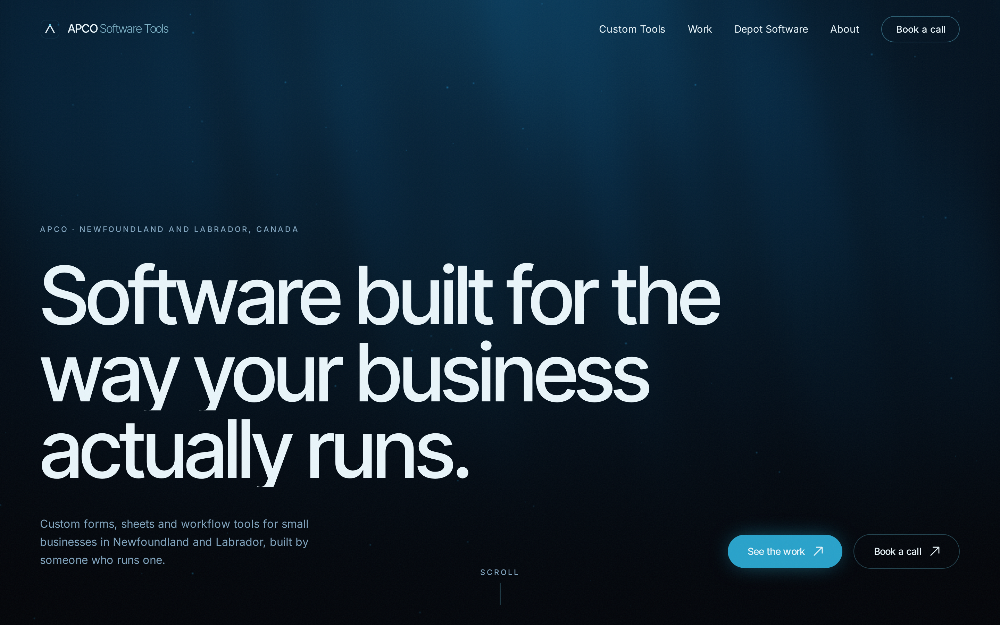
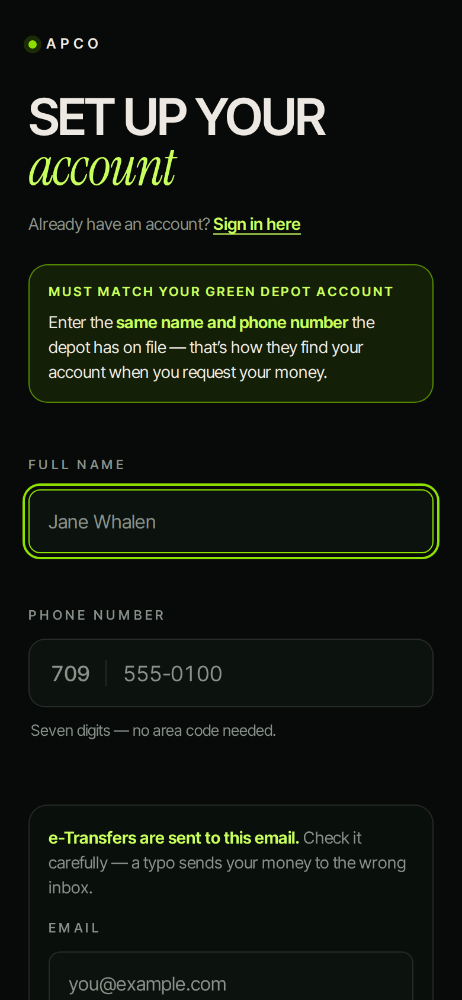

# Alexander Power

I build and ship production software with AI coding agents as my primary toolset, from a bottle depot in Newfoundland that I also run. Claude Code daily, Codex alongside, several sessions in parallel, split by file ownership, cross-reviewed, and proven with test harnesses where every green check has to show it can go red.

**Now:** [Receipts](https://github.com/alexjpower74-create/receipts): interview transcripts → themes and answers where every claim cites a verbatim quote, or is visibly dropped. Live demo, negative-control evals in CI, MCP server. *(link goes live with the repo)*

## Open source

| | |
|---|---|
| **[rig](https://github.com/alexjpower74-create/rig)** | Orchestration for builds where several coding agents work one repo at once. A plan file as the contract, file-ownership slices enforced by a commit guard, QA worktrees pinned to a sha, and a harness where a check that cannot fail is a failure (PASS / FAIL / VOID / UNPROVEN). Zero dependencies. |
| **[sightline](https://github.com/alexjpower74-create/sightline)** | Audits a small business website the way its owner experiences it and writes two pages: one for the owner, one for the developer. Reports only what it measured, never invents a number, never accuses a working site. |

## Live

| | |
|---|---|
| **[apcosoftwaretools.ca](https://apcosoftwaretools.ca)** | Company site. Vite + React, GSAP/Lenis motion, one R3F background, 116-test Playwright suite across Chromium and WebKit. |
| **[apco-app.pages.dev](https://apco-app.pages.dev)** | Customer app for a recycling depot, installed as a PWA. Real people, real money flow (e-Transfer requests), Worker-backed email. |

  
  

## How I work

Every build starts with a written contract the agents and I both read. Work is cut into slices by file ownership, each agent in its own worktree and branch, with a guard that refuses commits outside the slice. Nothing is called done until a harness has driven it with real input and each assertion has been shown to fail against a deliberately broken page. Then it gets committed, screenshotted and shipped.

Stack: TypeScript, Node, React, Cloudflare Workers / Pages / D1 / KV, Playwright, Anthropic and OpenAI APIs where they earn their place.

[apcosoftwaretools.ca](https://apcosoftwaretools.ca) · [LinkedIn](https://www.linkedin.com/in/alexander-power-b6626b36a/) · Newfoundland and Labrador, Canada
