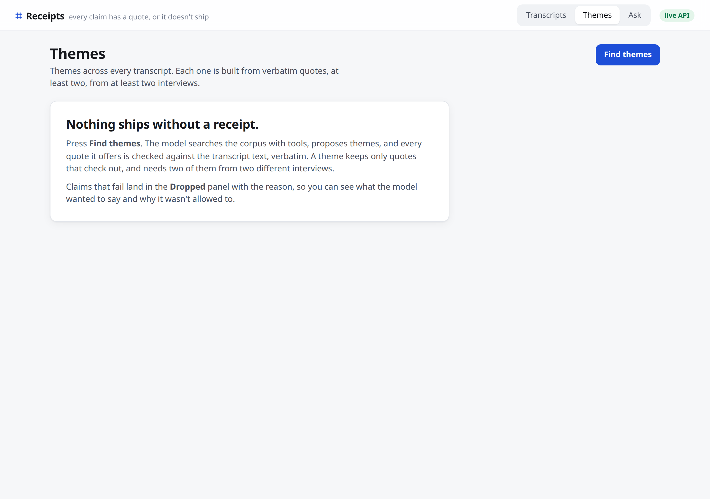
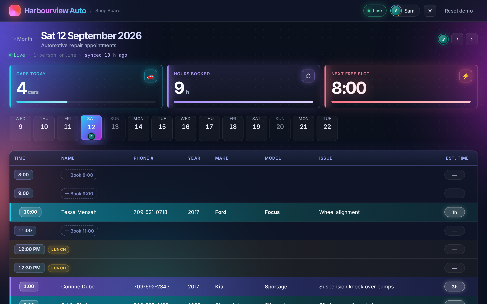
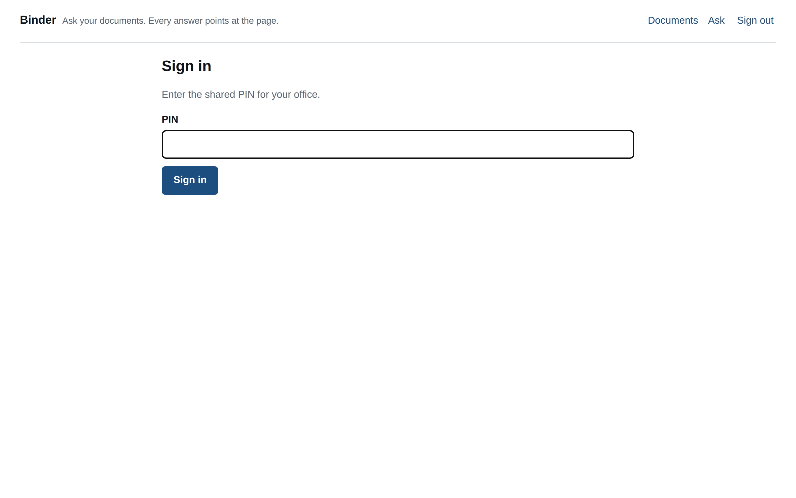
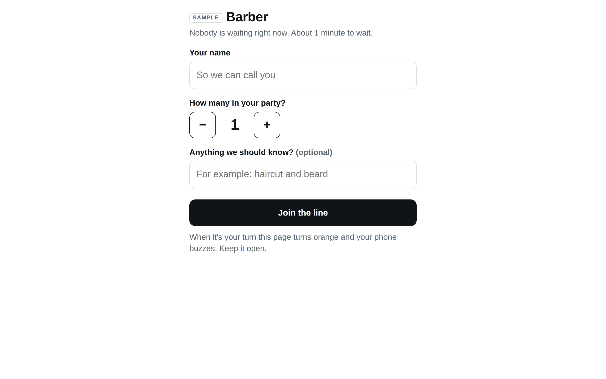
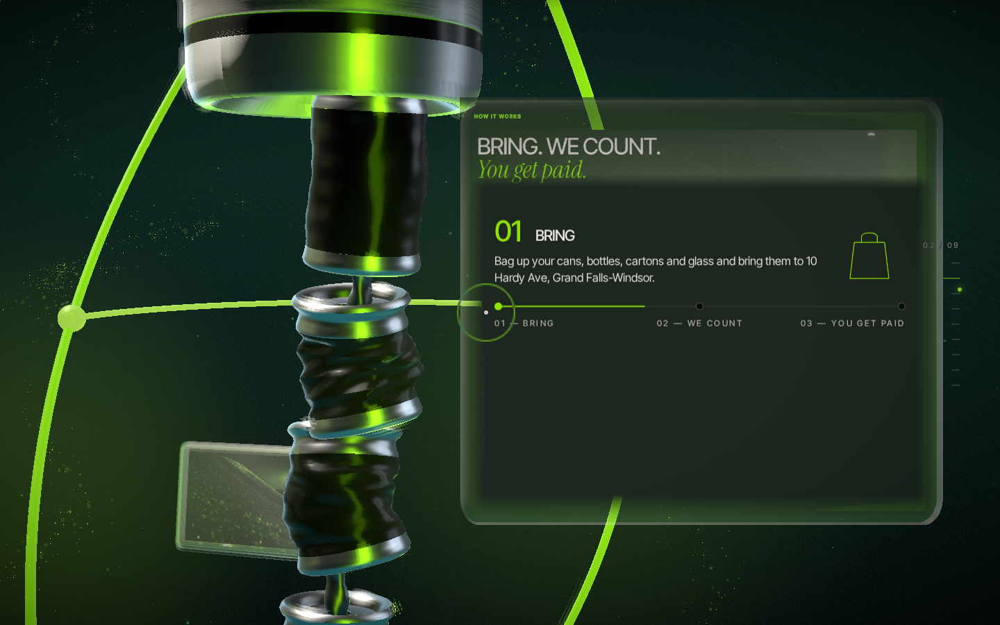

# Alexander Power

I build and ship production software with AI coding agents as my primary toolset, from a bottle depot in Newfoundland that I also run. Claude Code daily, Codex alongside, several sessions in parallel, split by file ownership, cross-reviewed, and proven with test harnesses where every green check has to show it can go red.

**Now:** [Receipts](https://github.com/alexjpower74-create/receipts): interview transcripts → themes and answers where every claim cites a verbatim quote, or is visibly dropped. [Live demo](https://receipts.alexjpower74.workers.dev), negative-control evals in CI, MCP server. Built in one day by a crew of three Claude Code sessions under rig.

## Open source

| | |
|---|---|
| **[rig](https://github.com/alexjpower74-create/rig)** | Orchestration for builds where several coding agents work one repo at once. A plan file as the contract, file-ownership slices enforced by a commit guard, QA worktrees pinned to a sha, and a harness where a check that cannot fail is a failure (PASS / FAIL / VOID / UNPROVEN). Zero dependencies. |
| **[sightline](https://github.com/alexjpower74-create/sightline)** | Audits a small business website the way its owner experiences it and writes two pages: one for the owner, one for the developer. Reports only what it measured, never invents a number, never accuses a working site. |

## Live

| | |
|---|---|
| **[receipts.alexjpower74.workers.dev](https://receipts.alexjpower74.workers.dev)** | Receipts, above. React + Cloudflare Worker + D1, Claude tool use, Playwright on Chromium and WebKit. [Source](https://github.com/alexjpower74-create/receipts). |
| **[binder-app.alexjpower74.workers.dev](https://binder-app.alexjpower74.workers.dev/)** | Binder: ask your documents; every sentence of the answer cites the page and a verbatim quote, with an eval set that plants a lie and must fail, and an MCP endpoint. [Source](https://github.com/alexjpower74-create/binder). |
| **[next-up-app.alexjpower74.workers.dev](https://next-up-app.alexjpower74.workers.dev/?p=sample-barber)** | Next Up: a walk-in queue for any waiting room, with a wall display at `/wall/`. Cloudflare Worker + D1, Playwright suite. [Source](https://github.com/alexjpower74-create/next-up). |
| **[return-rate-app.alexjpower74.workers.dev](https://return-rate-app.alexjpower74.workers.dev/)** | Return Rate: scan a container's barcode and see whether the Green Depot takes it, by Newfoundland and Labrador's rules only. The rules were researched from the regulation and MMSB's own documents, cited line by line; a 63-row oracle written from that document gates the rules engine, and products whose refund depends on the label are never guessed: the app tells you exactly what to read. 1,034 products, 44 real shelf barcodes verified live. [Source](https://github.com/alexjpower74-create/return-rate). |
| **[rota-app.alexjpower74.workers.dev](https://rota-app.alexjpower74.workers.dev/)** | Rota: who's on this Sunday, for a real church worship team. Personal links instead of passwords, away people can never be assigned, conflict-safe edits, a notice-board wall. Imported the team's real songs, services and channel list; evals 31 of 31 and a live round-trip 9 of 9. The QA journey caught a toast covering a button on a phone before anyone saw it. [Source](https://github.com/alexjpower74-create/rota). |
| **[truth-table-app.alexjpower74.workers.dev](https://truth-table-app.alexjpower74.workers.dev/)** | Truth Table: paste an AI's answer and the source it claims to come from; every sentence is marked supported, unsupported or contradicted, and "supported" is only ever granted when the exact words are shown in the source. Server-side quote verification, share links, Workers AI only. Evals: 22 of 22 planted lies caught, 21 of 21 quotes verbatim. [Source](https://github.com/alexjpower74-create/truth-table). |
| **[sightline.apcosoftwaretools.ca](https://sightline.apcosoftwaretools.ca)** | Sightline Live: the audit engine as a free public page. Type a website address, get a plain-English report on what the site is costing its owner, share the link. A one-at-a-time queue in front of real Chrome on an always-on box behind a Cloudflare Tunnel; never accuses a working site, never invents a number. Built by a crew of four Claude Code sessions under rig. [Source](https://github.com/alexjpower74-create/sightline-live). |
| **[shop-board.alexjpower74.workers.dev](https://shop-board.alexjpower74.workers.dev)** | Shop Board: a real-time multi-bay appointment board. Durable Object sync, presence, drag and drop with real pointer input, jobs that block their duration per bay, three themes (Cosmic, Classic, Dark), offline queue, PWA. 245 unit tests, 128 browser tests, and an adversarial suite that found six real bugs before release. [Source](https://github.com/alexjpower74-create/shop-board). |
| **[apcosoftwaretools.ca](https://apcosoftwaretools.ca)** | Company site. Vite + React, GSAP/Lenis motion, one R3F background, 116-test Playwright suite across Chromium and WebKit. |
| **[apco-recycling.pages.dev](https://apco-recycling.pages.dev)** | APCO Recycling: the depot's site as one WebGL world. The page orbits a branded aluminium can and descends a spine of crushed cans, each section docked onto a glass panel in the scene. R3F, GSAP, Lenis, Blender-built geometry, twelve Playwright harnesses driven with real wheel input across Chromium, WebKit and Firefox, a11y-clean, no-WebGL fallback. Built by four Claude Code sessions in worktrees. |
| **[apco-app.pages.dev](https://apco-app.pages.dev)** | Customer app for a recycling depot, installed as a PWA. Real people, real money flow (e-Transfer requests), Worker-backed email. |

  
  

## How I work

Every build starts with a written contract the agents and I both read. Work is cut into slices by file ownership, each agent in its own worktree and branch, with a guard that refuses commits outside the slice. Nothing is called done until a harness has driven it with real input and each assertion has been shown to fail against a deliberately broken page. Then it gets committed, screenshotted and shipped.

Stack: TypeScript, Node, React, Cloudflare Workers / Pages / D1 / KV, Playwright, Anthropic and OpenAI APIs where they earn their place.

[apcosoftwaretools.ca](https://apcosoftwaretools.ca) · [LinkedIn](https://www.linkedin.com/in/alexander-power-b6626b36a/) · Newfoundland and Labrador, Canada
