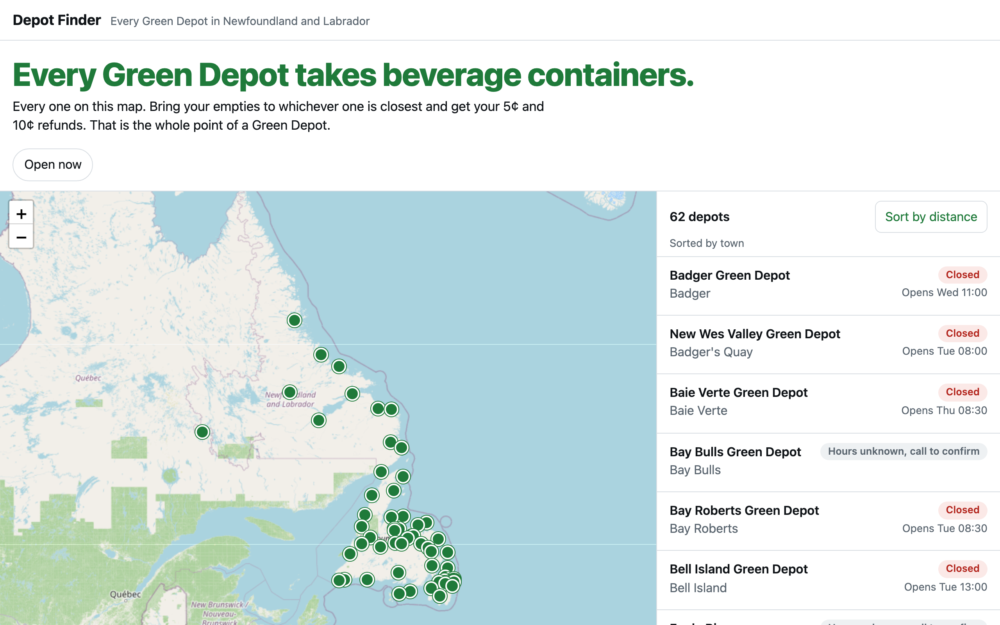
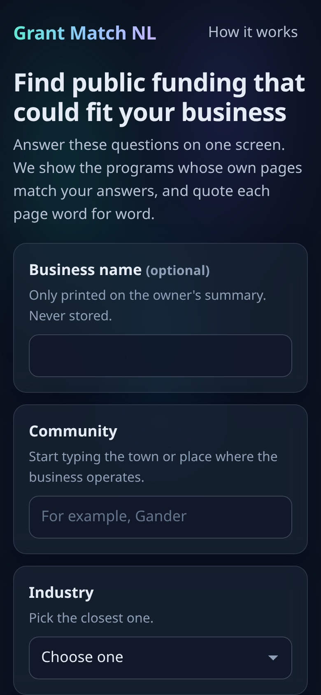
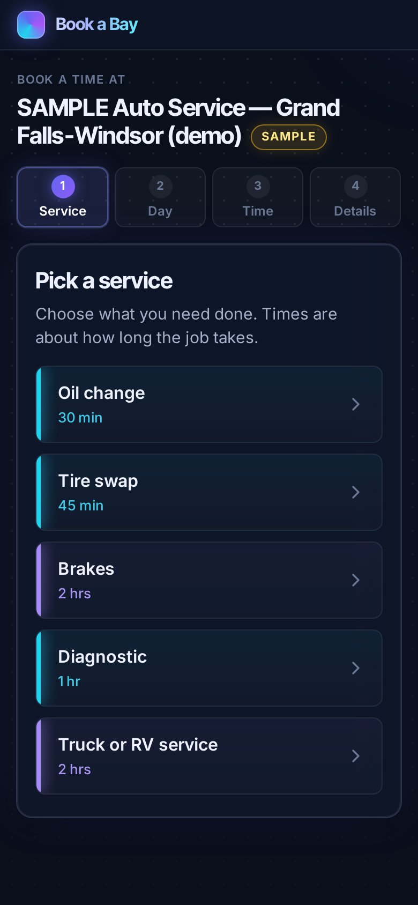

# Alexander Power

I build and ship production software with AI coding agents as my primary toolset, from a bottle depot in Newfoundland that I also run. Claude Code daily, Codex alongside, several sessions in parallel, split by file ownership, cross-reviewed, and proven with test harnesses where every green check has to show it can go red.

**Now:** [Receipts](https://receipts.alexjpower74.workers.dev): interview transcripts → themes and answers where every claim cites a verbatim quote, or is visibly dropped. Negative-control evals in CI, MCP server. Built in one day by a crew of three Claude Code sessions.

## Open source

| | |
|---|---|
| **[rig](https://github.com/alexjpower74-create/rig)** | Rig 2.0. Orchestration for builds where several coding agents work one repo at once: a brief-first plan file as the contract, file-ownership slices enforced by a commit guard, a fresh-eyes review step, QA worktrees pinned to a sha, and a finish gate that will not call a build done until the tests pass on that exact commit. Fifteen builds in one night. Zero dependencies, MIT. |
| **[sightline](https://github.com/alexjpower74-create/sightline)** | Audits a small business website the way its owner experiences it and writes two pages: one for the owner, one for the developer. Reports only what it measured, never invents a number, never accuses a working site. MIT licence. |

## Live

| | |
|---|---|
| **[receipts.alexjpower74.workers.dev](https://receipts.alexjpower74.workers.dev)** | Receipts, above. React + Cloudflare Worker + D1, Claude tool use, Playwright on Chromium and WebKit. |
| **[binder-app.alexjpower74.workers.dev](https://binder-app.alexjpower74.workers.dev/)** | Binder: ask your documents; every sentence of the answer cites the page and a verbatim quote, with an eval set that plants a lie and must fail, and an MCP endpoint. |
| **[next-up-app.alexjpower74.workers.dev](https://next-up-app.alexjpower74.workers.dev/?p=sample-barber)** | Next Up: a walk-in queue for any waiting room, with a wall display at `/wall/`. Cloudflare Worker + D1, Playwright suite. |
| **[return-rate-app.alexjpower74.workers.dev](https://return-rate-app.alexjpower74.workers.dev/)** | Return Rate: take a photo of a container, or scan its barcode, and see whether the Green Depot takes it, by Newfoundland and Labrador's rules only. The rules were researched from the regulation and MMSB's own documents and cited line by line; a 63-row oracle written from that document gates the rules engine; the photo is read by Cloudflare's vision model and decided by the rules, with the label evidence shown. Anything that isn't a beverage is a no. 1,034 products, 44 real shelf barcodes and a 10-photo label set verified live. |
| **[rota-app.alexjpower74.workers.dev](https://rota-app.alexjpower74.workers.dev/)** | Rota: who's on this Sunday, for a real church worship team. Personal links instead of passwords, away people can never be assigned, every change stamped with who made it, conflict-safe edits, a notice-board wall and a sound desk. Imported the team's real songs, services and channel list; evals 31 of 31, live round-trip 9 of 9, 68 browser tests on phone and desktop, and the QA journey caught a toast covering a button before anyone saw it. |
| **[depot-finder-app.alexjpower74.workers.dev](https://depot-finder-app.alexjpower74.workers.dev/)** | Depot Finder: every Green Depot in Newfoundland and Labrador on one map, with hours, phone, open-now in the depot's own time zone, and one headline: every one of them takes beverage containers. 62 rows researched from MMSB's locator, Product Care, EPRA and the depots' own pages, every fact cited with a saved copy of the source, and anything unconfirmed marked Unknown rather than guessed; the app deliberately shows only what is confirmed. Leaflet + a Cloudflare Worker for corrections. Unit and validator 29 of 29, 64 browser tests on phone and desktop. |
| **[truth-table-app.alexjpower74.workers.dev](https://truth-table-app.alexjpower74.workers.dev/)** | Truth Table: paste an AI's answer and the source it claims to come from; every sentence is marked supported, unsupported or contradicted, and "supported" is only ever granted when the exact words are shown in the source. Server-side quote verification, share links, Workers AI only. Evals: 22 of 22 planted lies caught, 21 of 21 quotes verbatim. |
| **[sightline.apcosoftwaretools.ca](https://sightline.apcosoftwaretools.ca)** | Sightline Live: the audit engine as a free public page. Type a website address, get a plain-English report on what the site is costing its owner, share the link. A one-at-a-time queue in front of real Chrome on an always-on box behind a Cloudflare Tunnel; never accuses a working site, never invents a number. Built by a crew of four Claude Code sessions. |
| **[shop-board.alexjpower74.workers.dev](https://shop-board.alexjpower74.workers.dev)** | Shop Board: a real-time multi-bay appointment board. Durable Object sync, presence, drag and drop with real pointer input, jobs that block their duration per bay, three themes (Cosmic, Classic, Dark), offline queue, PWA. 245 unit tests, 128 browser tests, and an adversarial suite that found six real bugs before release. |
| **[apcosoftwaretools.ca](https://apcosoftwaretools.ca)** | Company site. Vite + React, GSAP/Lenis motion, one R3F background, 116-test Playwright suite across Chromium and WebKit. |
| **[apco-recycling.pages.dev](https://apco-recycling.pages.dev)** | APCO Recycling: the depot's site as one WebGL world. The page orbits a branded aluminium can and descends a spine of crushed cans, each section docked onto a glass panel in the scene. R3F, GSAP, Lenis, Blender-built geometry, twelve Playwright harnesses driven with real wheel input across Chromium, WebKit and Firefox, a11y-clean, no-WebGL fallback. Built by four Claude Code sessions in worktrees. |
| **[tone-finder-app.alexjpower74.workers.dev](https://tone-finder-app.alexjpower74.workers.dev)** | Tone Finder. Type a tone ("Van Halen brown sound") and get amp, cab and starting knob values for an Axe-Fx II on Ares, every suggestion quoting a page of yek's amp model guide. Quotes are shown only if verified on the page, model names only if the guide uses them, guesses are labelled as guesses, and unsupported queries get "I can't point to the guide for that"; 88 core, 16 Worker and 188 Playwright tests with 40+ negative controls. SAMPLE data. [Source](https://github.com/alexjpower74-create/tone-finder). |
| **[school-closures-watch-app.alexjpower74.workers.dev](https://school-closures-watch-app.alexjpower74.workers.dev)** | School Closures Watch. Newfoundland parents pick their schools once and see whether each is open, delayed or closed, and whether the bus is affected, from the official NLSchools list. Every notice is the source's own words, verified as an exact substring of the saved page, with the time we first saw it; nothing is rewritten, ambiguous matches are flagged rather than applied, and "open" is only said while the source was checked successfully. 90 core, 23 Worker and 104 Playwright tests, 25 negative controls. SAMPLE data. [Source](https://github.com/alexjpower74-create/school-closures-watch). |
| **[daycare-day-sheet.alexjpower74.workers.dev](https://daycare-day-sheet.alexjpower74.workers.dev)** | Daycare Day Sheet. Daily paperwork for a small licensed child care centre in Newfoundland and Labrador: parents sign children in and out on a door tablet, staff see live staff-to-child ratios per room on their phones, each child gets a daily note home, and the office gets attendance and a CSV. The ratio limits are 21 rules quoted word for word from the Child Care Act and Regulations with citations, the register always tells the truth (a child is signed in even when the room goes over), and the Worker refuses a pick-up by anyone not on the child's list; 78 Worker tests, 182 Playwright runs on chromium and webkit, and 31 negative controls. SAMPLE data. [Source](https://github.com/alexjpower74-create/daycare-day-sheet). |
| **[home-care-visits.alexjpower74.workers.dev](https://home-care-visits.alexjpower74.workers.dev)** | Home Care Visits. Visit schedule, offline check-in/check-out and family links for a small Newfoundland home support agency, with exact hours per worker for payroll and per client per funder for billing. Location never blocks a visit, the family link never shows entry notes or phone numbers, and every distance says it is straight-line; 224 Playwright tests on chromium and webkit plus 31 negative controls. SAMPLE data. [Source](https://github.com/alexjpower74-create/home-care-visits). |
| **[visitor-log.alexjpower74.workers.dev](https://visitor-log.alexjpower74.workers.dev)** | Visitor Log. QR sign-in for visitors at a Newfoundland care home: a visitor signs in and out on their own phone, staff see who is in the building by unit, run a fire-drill roll call and export a contact list. It stores no health information about residents, never keeps screening answers, and deletes visitor records after the home's retention period; 77 Worker tests, 200 Playwright runs on chromium and webkit, and 35 negative controls that each go red. SAMPLE data. [Source](https://github.com/alexjpower74-create/visitor-log). |
| **[school-lunch-orders.alexjpower74.workers.dev](https://school-lunch-orders.alexjpower74.workers.dev)** | School Lunch Orders. Hot lunch pre-orders for a Newfoundland school: parents order on their phone with a family code, the kitchen gets totals by item and class with allergens flagged, teachers mark lunches given out, the office keeps the ledger. It takes no payments and sends nothing, warns in red only on a child's own ticked allergies (Health Canada's list, quotes checked word for word against saved sources) and refuses the order until the parent says "I understand"; 64 Worker tests, 192 Playwright runs on chromium and webkit, 36 negative controls shown red. SAMPLE data. [Source](https://github.com/alexjpower74-create/school-lunch-orders). |
| **[town-service-requests.alexjpower74.workers.dev](https://town-service-requests.alexjpower74.workers.dev)** | Town Service Requests. Prototype. Residents of a small town report a pothole, a dark streetlight or a missed plow with a pin on the map and follow it on a status link; the town office works the requests from a board with crews, overdue flags and a weekly report. The public status link never shows a name, phone, description, photo or exact pin, every date is Newfoundland time, and nothing is emailed or texted; 50 API tests, 164 Playwright runs across Chromium and WebKit, 20 negative controls. SAMPLE data. [Source](https://github.com/alexjpower74-create/town-service-requests). |
| **[book-a-bay.alexjpower74.workers.dev](https://book-a-bay.alexjpower74.workers.dev)** | Book a Bay. Online booking requests for a small auto repair shop, an add-on to Shop Board: pick a service and a time from real bay capacity, the shop confirms from a PIN-locked page, the customer follows a status link and gets a calendar file. SAMPLE shop. Playwright 156 tests, Chromium and WebKit. [Source](https://github.com/alexjpower74-create/book-a-bay). |
| **[sightline.apcosoftwaretools.ca](https://sightline.apcosoftwaretools.ca)** | Sightline Live: the audit engine as a free public page. Type a website address, get a plain-English report on what the site is costing its owner, share the link. A one-at-a-time queue in front of real Chrome on an always-on box behind a Cloudflare Tunnel; never accuses a working site, never invents a number. [Source](https://github.com/alexjpower74-create/sightline-live). |
| **[grants.apcosoftwaretools.ca](https://grants.apcosoftwaretools.ca)** | Grant Match NL. A Newfoundland and Labrador business answers one profile screen and gets the public funding programs that could fit, every eligibility fact quoted word for word from the program's own page, "Unknown" where the page doesn't say. Rules, no model guessing; a weekly Worker re-reads every source page. [Source](https://github.com/alexjpower74-create/grant-match-nl). |
| **[apco-app.pages.dev](https://apco-app.pages.dev)** | Customer app for a recycling depot, installed as a PWA. Real people, real money flow (e-Transfer requests), Worker-backed email. |

  
  
  
  

## How I work

Every build starts with a written contract the agents and I both read. Work is cut into slices by file ownership, each agent in its own worktree and branch, with a guard that refuses commits outside the slice. Nothing is called done until a harness has driven it with real input and each assertion has been shown to fail against a deliberately broken page. Then it gets committed, screenshotted and shipped.

Stack: TypeScript, Node, React, Cloudflare Workers / Pages / D1 / KV, Playwright, Anthropic and OpenAI APIs where they earn their place.

[apcosoftwaretools.ca](https://apcosoftwaretools.ca) · [LinkedIn](https://www.linkedin.com/in/alexander-power-b6626b36a/) · Newfoundland and Labrador, Canada
