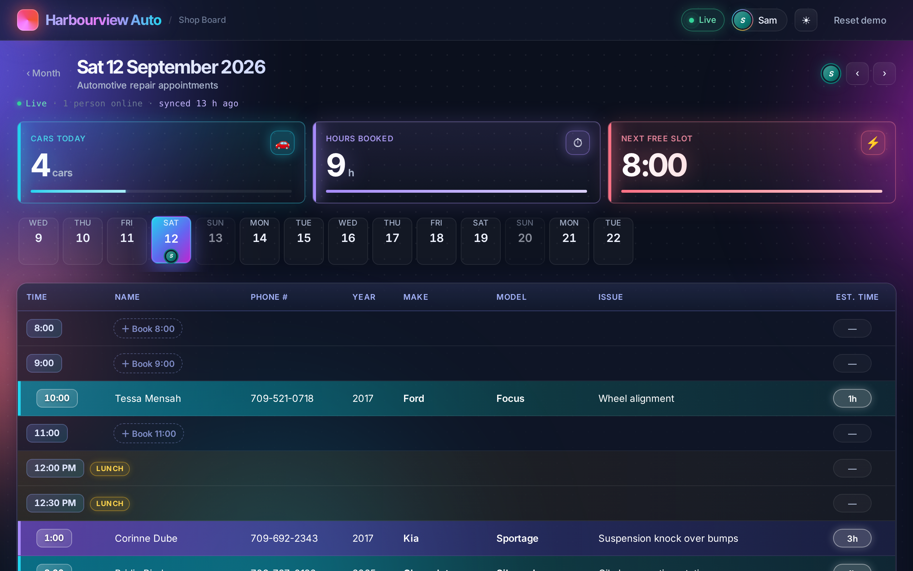
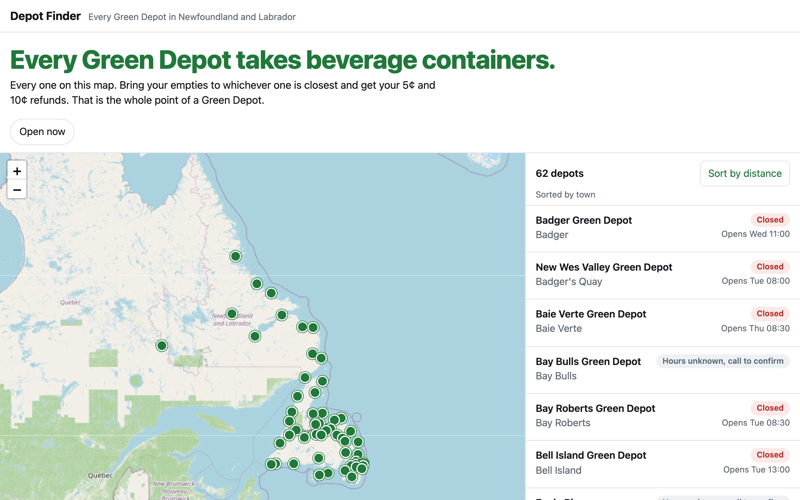
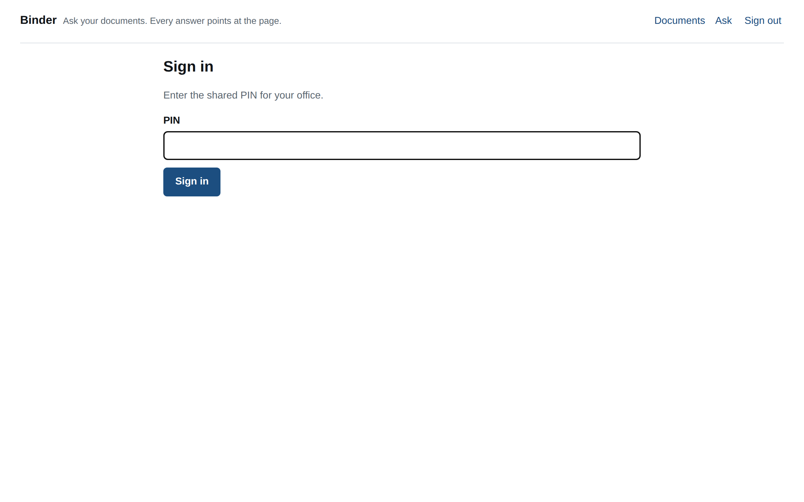
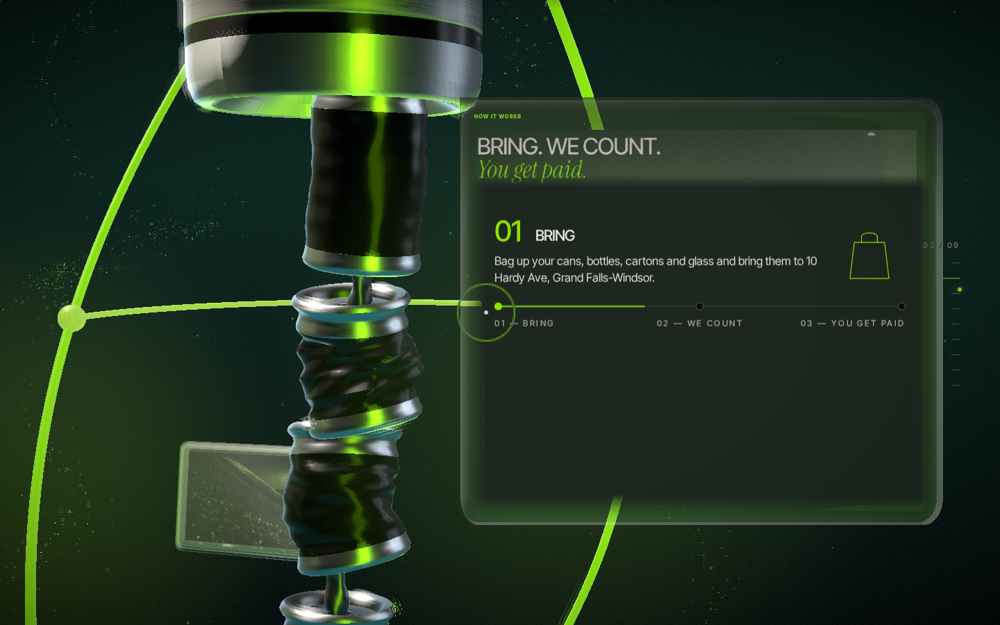
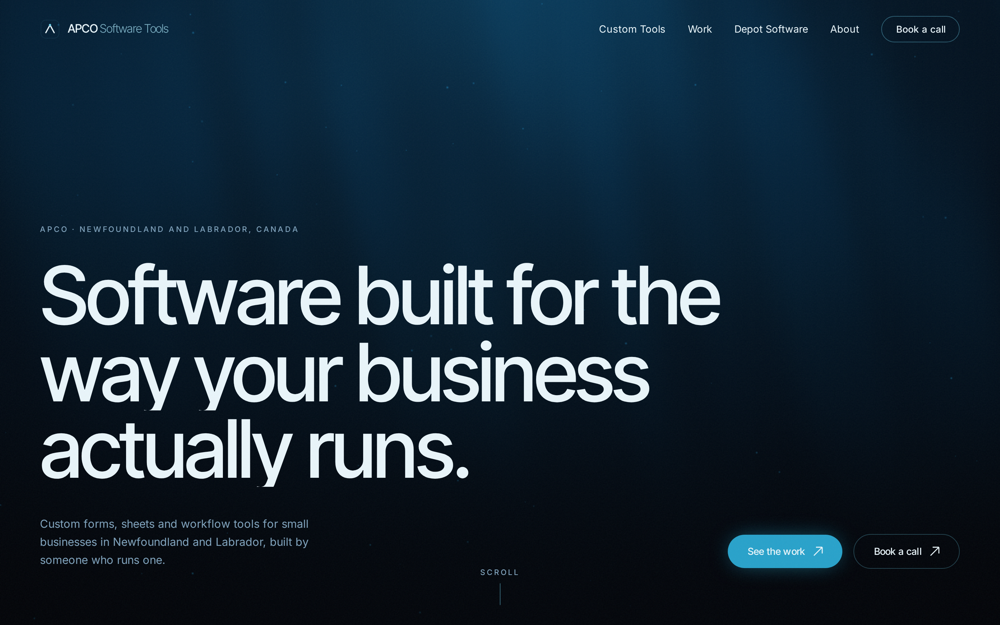
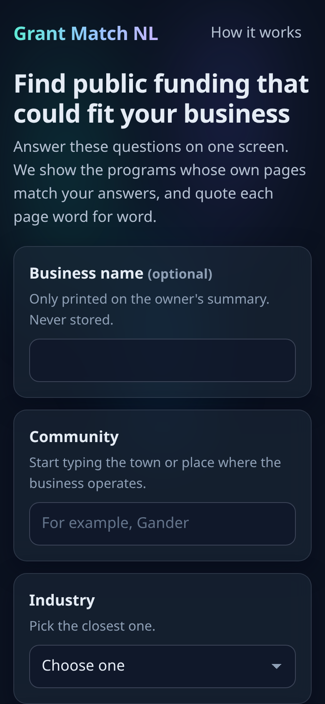
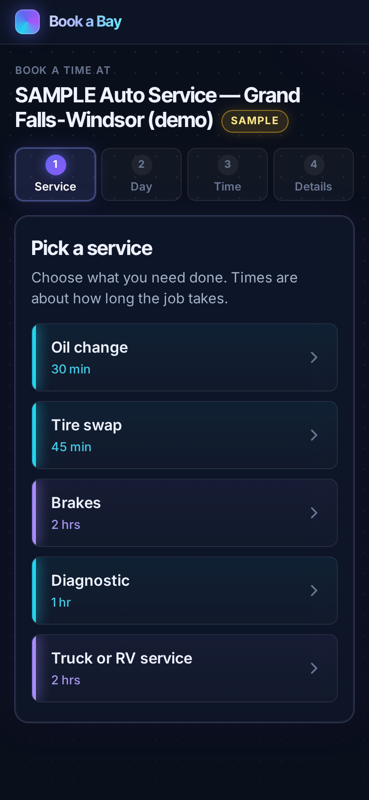

# Alexander Power

I build software for small businesses in Newfoundland and Labrador, where I also run a bottle depot. Everything below is live: click a link and try it.

## Try them

| | |
|---|---|
| **[Shop Board](https://shop-board.alexjpower74.workers.dev)** | A real-time appointment board for a small service shop: bays, drag and drop, three themes, works offline. |
| **[Book a Bay](https://book-a-bay.alexjpower74.workers.dev)** | Online booking requests for an auto repair shop. Customers pick a service and a time, the shop confirms, the customer follows a status link. |
| **[Receipts](https://receipts.alexjpower74.workers.dev)** | Interview transcripts in, themes and answers out, where every claim cites a word-for-word quote. |
| **[Binder](https://binder-app.alexjpower74.workers.dev/)** | Ask your own documents. Every sentence of the answer cites the page and the exact quote. |
| **[Truth Table](https://truth-table-app.alexjpower74.workers.dev/)** | Paste an answer and the source it claims to come from; every sentence is marked supported, unsupported or contradicted. |
| **[Next Up](https://next-up-app.alexjpower74.workers.dev/?p=sample-barber)** | A walk-in queue for any waiting room: join by QR code, with a big wall display. |
| **[Return Rate](https://return-rate-app.alexjpower74.workers.dev/)** | Photograph a container or scan its barcode and see whether a Green Depot takes it, by Newfoundland and Labrador's rules. |
| **[Depot Finder](https://depot-finder-app.alexjpower74.workers.dev/)** | Every Green Depot in Newfoundland and Labrador on one map, with hours, phone and open-now. |
| **[Grant Match NL](https://grants.apcosoftwaretools.ca)** | Answer one screen about your business and see the public funding programs that could fit. |
| **[Sightline](https://sightline.apcosoftwaretools.ca)** | Type a website address and get a plain-English report on what the site is costing its owner. |
| **[Rota](https://rota-app.alexjpower74.workers.dev/)** | Who's on this Sunday: a church worship-team rota with personal links, away dates and a sound desk. |
| **[Tone Finder](https://tone-finder-app.alexjpower74.workers.dev)** | Type a guitar tone and get amp, cab and starting knob settings for an Axe-Fx II. |
| **[Daycare Day Sheet](https://daycare-day-sheet.alexjpower74.workers.dev)** | Sign-in, live staff-to-child ratios and daily notes home for a small licensed child care centre. |
| **[Home Care Visits](https://home-care-visits.alexjpower74.workers.dev)** | Visit schedule, offline check-in and family links for a home support agency. |
| **[Visitor Log](https://visitor-log.alexjpower74.workers.dev)** | QR sign-in for visitors at a care home, with a fire-drill roll call. |
| **[School Lunch Orders](https://school-lunch-orders.alexjpower74.workers.dev)** | Hot lunch pre-orders for a school, with allergy warnings and kitchen totals. |
| **[School Closures Watch](https://school-closures-watch-app.alexjpower74.workers.dev)** | Pick your schools once and see whether each is open, delayed or closed. |
| **[Town Service Requests](https://town-service-requests.alexjpower74.workers.dev)** | Residents report a pothole or a dark streetlight on a map; the town office works the list. |
| **[APCO Recycling](https://apco-recycling.pages.dev)** | A bottle depot's website as one 3D scene. |
| **[APCO Software Tools](https://apcosoftwaretools.ca)** | My company site. |

Demo apps use sample data.

  
  
  

[apcosoftwaretools.ca](https://apcosoftwaretools.ca) · [LinkedIn](https://www.linkedin.com/in/alexander-power-b6626b36a/) · Newfoundland and Labrador, Canada
